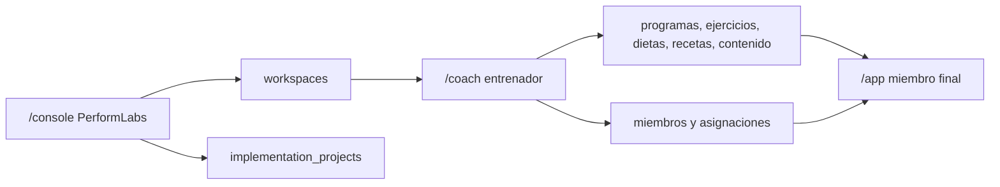

# Arquitectura Quirurgica Supabase

Este documento define el contrato tecnico para construir PerformLabs sin mezclar
la consola interna, la consola del entrenador y la app del miembro final.

## Superficies

- `/console`: consola interna PerformLabs. Gestiona leads, implantaciones, marcas,
  dominios, seguridad, calidad y soporte operativo.
- `/coach`: consola del entrenador. Gestiona su marca, miembros, entrenamientos,
  nutricion, contenido, check-ins, notificaciones y analitica.
- `/app`: app del miembro final. Solo consume la experiencia publicada para su
  workspace.

Regla: ningun dato interno de `/console` debe aparecer en `/app`.

## Resolucion De Marca

La marca se resuelve antes de leer cualquier dato operativo. El orden permitido es:

- Cookie interna `performlabs_workspace_id`.
- `workspace.id` cuando viene desde una accion interna.
- `workspace.slug` para selectores cortos como `marca-blanca`.
- `public_domain`, por ejemplo `tumarca.com`.
- `member_domain`, por ejemplo `miembros.tumarca.com`.
- `fallback_subdomain`, por ejemplo `marca-blanca.performlabs.app`.

El resolver nunca debe filtrar una columna UUID con un slug. Si el valor no tiene
forma de UUID, se busca solo en columnas de texto.

## Workspaces

`public.workspaces` es la raiz del tenancy:

- `id`: identificador interno.
- `slug`: selector estable para consola/app.
- `name`: nombre comercial.
- `app_name`: nombre que ve el miembro final.
- `custom_domain`: compatibilidad con el modelo anterior.
- `public_domain`: web publica del entrenador.
- `member_domain`: app privada de miembros.
- `fallback_subdomain`: subdominio tecnico PerformLabs.
- `support_email`: contacto de soporte de la marca.
- `accent_color`: color primario.
- `is_active`: activacion operativa.

Cada tabla operativa debe depender de `workspace_id` cuando el dato pertenezca a
una marca concreta.

## Hilo Operativo Privado

`public.workspace_entitlements` es el conector invisible entre la plataforma base
y cada marca. No aparece como PerformLabs en `/coach` ni en `/app`, pero define si
el workspace puede operar.

Estados:

- `active`: experiencia completa.
- `past_due`: aviso interno sin cortar todavia la experiencia.
- `suspended`: consola del entrenador y app del miembro quedan pausadas.
- `revoked`: licencia revocada; las superficies de cliente se bloquean.
- `terminated`: relacion operativa finalizada.

Modulos controlables:

- `member_app`
- `coach_console`
- `training`
- `nutrition`
- `checkins`
- `content`
- `notifications`
- `billing`

El bloqueo debe suspender acceso, sesiones y operativa, no destruir datos como
castigo automatico. La retencion, exportacion o borrado se ejecuta solo bajo
contrato, privacidad y proceso interno.

## Permisos

Roles base:

- `platform_owner`: todo PerformLabs.
- `agency_admin`: operaciones internas de varias marcas.
- `coach_admin`: dueno operativo de un workspace.
- `coach_staff`: equipo del entrenador.
- `member`: cliente final.

Patron RLS:

- Las tablas de workspace se leen/escriben solo si el usuario pertenece al
  workspace con el rol adecuado.
- Las bibliotecas globales usan `workspace_id is null` para ejercicios,
  ingredientes o formulas base.
- El miembro final solo accede a su perfil, planes asignados, check-ins y contenido
  publicado de su workspace.

## Flujo De Datos

## Modulos Operativos

### Entrenamiento

- `exercises`
- `exercise_categories`
- `exercise_videos`
- `workout_templates`
- `workout_template_days`
- `workout_template_exercises`
- `assigned_workout_plans`

### Nutricion

- `ingredients`
- `recipes`
- `recipe_ingredients`
- `diet_categories`
- `diet_templates`
- `diet_template_meals`
- `nutrition_formulas`
- `assigned_meal_plans`
- `member_diet_preferences`

### Miembros

- `member_profiles`
- `member_subscriptions`
- `member_fitness_preferences`
- `progress_entries`
- `progress_photos`
- `customer_checkins`

### Contenido Y App

- `app_settings`
- `app_pages`
- `content_pages`
- `app_banners`
- `media_files`
- `notification_templates`
- `scheduled_notifications`

## Fases De Construccion

1. Resolver marca y dominios con seguridad.
2. Conectar `/coach/programs` con `/app/workouts`.
3. Conectar `/coach/nutrition` con `/app/meals`.
4. Conectar `/coach/members` con asignaciones reales.
5. Convertir check-ins en flujo completo miembro -> coach -> ajuste de plan.
6. Activar contenido, banners, mensajes y notificaciones por marca.
7. Anadir algoritmos de generacion de entrenamientos y comidas.
8. Endurecer Storage, RLS y auditoria antes de publicar a gran escala.

## Principios

- Primero resolver workspace, despues leer datos.
- Todo lo que toque al miembro final debe poder explicarse como producto premium,
  no como detalle tecnico.
- El coach controla su negocio desde `/coach`; PerformLabs controla la plataforma
  desde `/console`.
- Los cambios estructurales entran por migracion, no por parches manuales sueltos.
